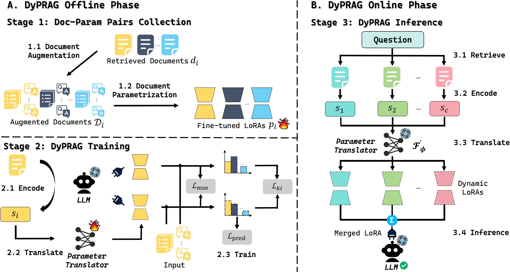

# Dynamic Parametric Rretireval Augmented Generation

## Overview

Overview of Dynamic Parametric RAG:

> **Dynamic Parametric RAG (DyPRAG)** is a novel framework that utilizes a lightweight parameter translator model to efficiently map documents into parameterized knowledge by modeling the underlying function from documents to parameters, reducing inference, training and storage costs while enhancing LLMs knowledge in a plug-and-play manner at test-time.

- Extensive experiments on multiple datasets demonstrate DyPRAG’s effectiveness and generalization in test-time knowledge enhancement. 
- DyPRAG dynamically integrates parameterized knowledge to resolve conflicts between contextual and parametric knowledge, offering a practical solution to mitigate RAG hallucination in real-world applications.

|Method|Inference Cost|Training Cost|Storage Cost|Generalization|Hallucination|
|---|---|---|---|---|---|
|RAG|🥶|🤓|🤓|🤓|🥶|
|PRAG|🤓|🥶|🥶|🥶|😳|
|DyPRAG|🤓|😳|🤓|🤓|🤓|



We propose simple pipeline to achieve DyPRAG.
* Stage 1: Collecting Doc-Param Pairs by offline parametrization.
* Stage 2: Training parameter translator by mimic the target LoRA behavior.
* Stage 3: Leveraging parameter translator to enhance LLM's knowledge at test-time.

## Requirements
```
cd DyPRAG
conda create -n dyprag python=3.10.4
conda activate dyprag
pip install -r requirements.txt
```
## Data Preparation
We following [PRAG](https://github.com/oneal2000/PRAG) to prepare the data.
**Prepare retrival data: BM25**
1. Download the Wikipedia dump from the [DPR repository](https://github.com/facebookresearch/DPR/blob/main/dpr/data/download_data.py#L32) using the following command:
```
mkdir -p data/dpr
wget -O data/dpr/psgs_w100.tsv.gz https://dl.fbaipublicfiles.com/dpr/wikipedia_split/psgs_w100.tsv.gz
pushd data/dpr
gzip -d psgs_w100.tsv.gz
popd
```
2. Use Elasticsearch to index the Wikipedia dump
```
cd data
wget -O elasticsearch-8.15.0.tar.gz https://artifacts.elastic.co/downloads/elasticsearch/elasticsearch-8.15.0-linux-x86_64.tar.gz  # download Elasticsearch
tar zxvf elasticsearch-8.15.0.tar.gz
rm elasticsearch-8.15.0.tar.gz 
cd elasticsearch-8.15.0
nohup bin/elasticsearch > es.log 2>&1 &  # run Elasticsearch in background
cd ../..
python prep_elastic.py --data_path data/dpr/psgs_w100.tsv --index_name wiki  # build index
```
**Prepare dataset**
For 2WikiMultihopQA:

Download the [2WikiMultihopQA](https://www.dropbox.com/s/ms2m13252h6xubs/data_ids_april7.zip?e=1) dataset from its repository https://www.dropbox.com/s/ms2m13252h6xubs/data_ids_april7.zip?e=1. Unzip it and move the folder to data/2wikimultihopqa.

For HotpotQA:

```
mkdir -p data/hotpotqa
wget -P data/hotpotqa/ http://curtis.ml.cmu.edu/datasets/hotpot/hotpot_dev_distractor_v1.json
```
For PopQA:

Download the [PopQA](https://github.com/AlexTMallen/adaptive-retrieval/blob/main/data/popQA.tsv) dataset from its repository https://github.com/AlexTMallen/adaptive-retrieval/blob/main/data/popQA.tsv, and put the file popQA.tsv into folder data/popqa.

```
mkdir -p data/popqa
wget -P data/popqa https://github.com/AlexTMallen/adaptive-retrieval/blob/main/data/popQA.tsv
```

For ComplexWebQuestions:

Download the [ComplexWebQuestions](https://www.dropbox.com/scl/fo/nqujvpg2gc4y0ozkw3wgr/AOzjVEsdUhv2Fx2pamfJlSw?rlkey=746t7xehfqxf1zr867nxiq8aq&e=1) dataset from its repository https://www.dropbox.com/scl/fo/nqujvpg2gc4y0ozkw3wgr/AOzjVEsdUhv2Fx2pamfJlSw?rlkey=746t7xehfqxf1zr867nxiq8aq&e=1, and put the file ComplexWebQuestions_dev.json into folder data/complexwebquestions.

For StrategyQA:
```
wget -O data/strategyqa_dataset.zip https://storage.googleapis.com/ai2i/strategyqa/data/strategyqa_dataset.zip
mkdir -p data/strategyqa
unzip data/strategyqa_dataset.zip -d data/strategyqa
rm data/strategyqa_dataset.zip 
```

For IIRC:
```
wget -O data/iirc.tgz https://iirc-dataset.s3.us-west-2.amazonaws.com/iirc_train_dev.tgz
tar -xzvf data/iirc.tgz
mv iirc_train_dev/ data/iirc
rm data/iirc.tgz
```

For RAGTruth:
Download the [RAGTruth](https://github.com/ParticleMedia/RAGTruth/blob/main/dataset/) dataset from its repository https://github.com/ParticleMedia/RAGTruth/blob/main/dataset/, and put  `source_info.jsonl` into folder data/ragtruth.

## Three Stages Reproduce of DyPRAG
### Stage1: Doc-Param Pair Collection
1. **Data Augmentation**
```
python src/augment.py \
    --model_name llama3.2-1b-instruct \
    --dataset 2wikimultihopqa \
    --data_path data/2wikimultihopqa/ \
    --sample 300  \
    --topk 3
    --output_dir data_aug_projector
    --projector
```
| **Parameter** | **Example/Options** |
| ------------------------------ | ---------------------------------------------------- |
| `model_name` | `llama3.2-1b-instruct`, `qwen2.5-1.5b-instruct`, `llama3-8b-instruct` |
| `dataset` | `2wikimultihopqa`, `hotpotqa`, `popqa`, `complexwebquestions` |
| `data_path` | folder to the saved data, such as `data/2wikimultihopqa` |
| `sample` | Number of questions to run |
| `topk` | retrieval number |
| `output_dir` | folder to save the augmented data |
| `projector` | whether to use projector |
The results of data augmentation will be stored in the file `{output_dir}/{dataset}/{data_type}.json`. To reproduce PRAG, you should set `output_dir` to `data_aug` and without `projector`.
2. **Document Parameterizing**
By calling the `src/encode.py` file, you will generate a parameterized representation $p_i$ of each document $d_i$ for the given dataset. The parameters for this file are as follows:

```
python3 src/encode.py \
    --model_name=llama3.2-1b-instruct \
    --dataset=2wikimultihopqa \
    --sample=300 \
    --per_device_train_batch_size=1 \
    --num_train_epochs=1 \
    --learning_rate=0.0003 \
    --lora_rank=2 \
    --lora_alpha=32 \
    --with_cot \
    --projector
```

| **Parameter**                  | **Example/Options**                                  |
| ------------------------------ | ---------------------------------------------------- |
| `model_name`                   | `llama3.2-1b-instruct`, `qwen2.5-1.5b-instruct`, `llama3-8b-instruct` |
| `dataset`                      | `2wikimultihopqa`, `hotpotqa`, `popqa`, `complexwebquestions` |
| `data_type`                    | Not set means using the entire dataset, otherwise, specify a particular data type |
| `with_cot`                     | If included, generate a CoT |
| `sample`                        | Number of questions to run |
| `augment_model`                | Model used for data augmentation. If not set, the current model will be used for augmentation |
| `per_device_train_batch_size`, `num_train_epochs`, `learning_rate` | Training parameters |
| `lora_rank`, `lora_alpha`       | LoRA parameters, dropout will be set to 0 |
| `projector`                     | Whether to use projector |

Set `projector` to encode the data from `data_aug_projector` folder and for PRAG unset `projector` to encode the data from `data_aug` folder.


All generated parameters are stored in the `offline` folder. 
The specific location of the parameter files is as follows:

```plain
offline/
├── {model_name}/
│   └── rank={lora_rank}_alpha={lora_alpha}/
│       ├── base_weight/
│       └── {dataset}/
│           └── lr={learning_rate}_epoch={num_train_epochs}/
│               └── aug_model={augment_model}/
│                   └── {data_type}/
│                       └── data_{did}/
│                           └── passage_{pid}/
|                               └── parameters
```

### Stage2: DyPRAG Training
```
python3 -u src/train_dyprag.py \
    --model_name=llama3-8b-instruct \
    --datasets="2wikimultihopqa,hotpotqa,popqa,complexwebquestions" \
    --learning_rate=0.0003 \
    --lora_rank=2 \
    --lora_alpha=32 \
    --max_new_tokens=128 \
    --sample_rate=1 \
    --dyprag_learning_rate=1e-5 \
    --dyprag_train_epochs=1 \
```
| **Parameter** | **Example/Options** |
| ------------------------------ | ---------------------------------------------------- |
| `model_name` | `llama3.2-1b-instruct`, `qwen2.5-1.5b-instruct`, `llama3-8b-instruct` |
| `datasets` | datasets used for training DyPRAG |
| `learning_rate` | learning rate in stage 1 |
| `lora_rank`, `lora_alpha` | LoRA settings in stage 1 |
| `max_new_tokens` | max generate tokens in stage 2 |
| `sample_rate` | sample rate for alignment datasets $\mathcal{K}$ |
| `dyprag_learning_rate` | learning rate in stage 2 |
| `dyprag_train_epochs` | training epochs in stage 2 |

The well-trained parameter translator $\mathcal{F}^\prime_\phi$ will be saved in `projector/f'{args.model_name}_hidden{args.projector_p}_sample{args.sample_rate}_lr{args.dyprag_learning_rate}` folder.
### Stage3: DyPRAG Inference
```
python3 src/inference_dyprag.py \
    --model_name=llama3-8b-instruct \
    --dataset=hotpotqa \
    --sample=-1 \
    --num_train_epochs=1 \
    --learning_rate=0.0003 \
    --lora_rank=2 \
    --lora_alpha=32 \
    --max_new_tokens=128 \
    --inference_method=dyprag \
    --inference_epoch=1 \
    --projector_path=projector_path \
    --projector_p=32
    --with_cot \
```
| **Parameter** | **Example/Options** |
| ------------------------------ | ---------------------------------------------------- |
| `inference_epoch` | selected epoch checkpoint for inference |
| `projector_path` | path to trained parameter translator |
| `inference_method` | `dyprag` or `dyprag_combine` |
| `projector_p` | intermediate size of parameter translator |

You can use similar command to inference RAGTruth.

#### RAGTruth Evaluation
```
python -u ./src/evaluate_ragtruth.py \
    --dyprag_path=dyprag_output_path \
    --rag_path=rag_output_path \
    --output_path=output_path
```

## Citation
If you find our work useful in your research and would like to cite our project, please use the following citation:
```
```